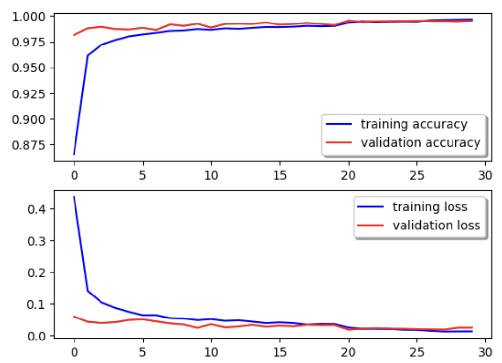
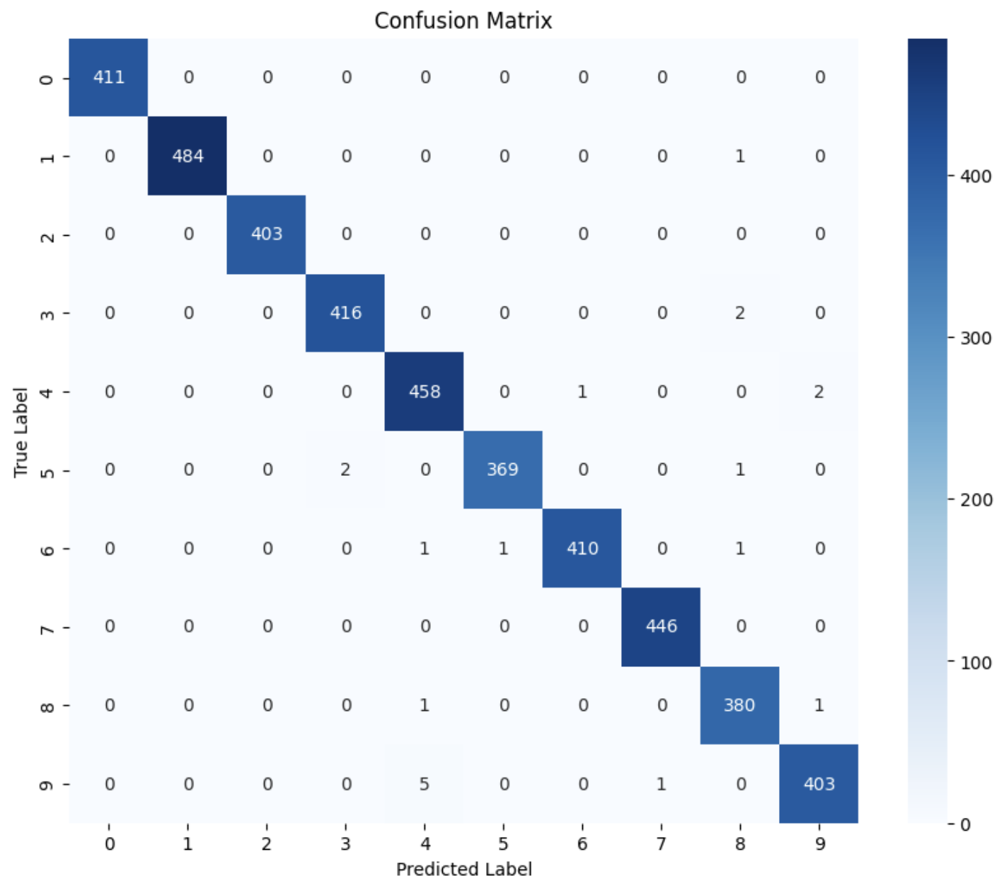

# Digit Recognizer - Deep Learning CNN


## Introduction
Kaggle hosts a set of beginner competitions that challenge users to explore different deep learning networks. This project specifically tackles the classic MNIST Digit Recognizer challenge using Convolutional Neural Networks (CNNs). 

After studying *Understanding Deep Learning*, I applied the concepts learned into this practical space. Additionally, this project served as a learning experience to build a CNN from scratch utilizing **TensorFlow** and **Keras** (transitioning from standard PyTorch), broadening my understanding of different deep learning libraries.

## Performance
On the second attempt, the model achieved a validation accuracy of **99.52%**, placing it within approximately the **Top 10%** of competitors on the Kaggle leaderboard (as of February 25th, 2026). 

While the performance is strong, there is still room for improvement. Future iterations will aim to push the accuracy beyond the 99.6% threshold.

<div align="center">
  
</div>

## Data Preparation & Augmentation
The dataset provided by Kaggle contained testing and training sets. To prevent model memorization (overfitting) and ensure the model generalizes well to unseen data, the training data was split into a 90% training and 10% validation set. 

Data preprocessing included:
* **Normalization:** Pixel values were scaled down from 0-255 to 0.0-1.0 to ensure faster convergence.
* **Reshaping:** Data was reshaped into `(-1, 28, 28, 1)` to represent standard grayscale images.
* **Label Encoding:** Labels were converted to distinct buckets using One-Hot Encoding (`to_categorical`).

To artificially expand the training dataset and improve model robustness, I utilized `ImageDataGenerator` from `tensorflow.keras.preprocessing.image` to apply random transformations:
* **Rotation Range:** 10 degrees
* **Zoom Range:** 10%
* **Width & Height Shifts:** 10% (0.1)

## Model Architecture
The network was built using the `Sequential` API and consists of three convolutional blocks followed by a fully connected network.

* **Convolutional Layers:** Three `Conv2D` layers utilizing 32, 64, and 128 filters respectively, with a `5x5` kernel size and `ReLU` activation.
* **Batch Normalization:** Applied after each convolutional layer to stabilize and accelerate the training process.
* **Max Pooling:** `MaxPooling2D` with a 2x2 pool size was used to downsample feature maps and reduce computational load.
* **Dropout Regularization:** Rates of 0.25 and 0.50 were strategically placed after the convolutional blocks and the dense layer to heavily combat overfitting by forcing the network to learn robust features.
* **Classification Head:** A `Flatten` layer feeding into a 128-neuron `Dense` layer, ending with a 10-neuron `Softmax` output for digit classification (0-9).

## Training Strategy: Optimizers and Annealers
### Optimizer
To prevent model instability and allow for smoother learning, the **Adam** optimizer was utilized. Adam regulates the mean and variance via decay rates, effectively eliminating model bias and allowing the model to bypass local minima to continue reducing categorical cross-entropy loss.

### Learning Rate Annealing
Pushing the model's performance requires adjusting the learning rate dynamically. I implemented `ReduceLROnPlateau` to monitor the `val_accuracy`:
* **Patience (5):** The learning rate only adjusts if no improvement is seen after 5 epochs, preventing erratic learning rate spikes.
* **Factor (0.5):** Reduces the learning rate by half, providing a middle ground that prevents learning stagnation while avoiding exploding gradients.
* **Minimum LR:** Capped at `0.00001` to ensure the model doesn't learn at a paralyzingly slow rate.

## Error Analysis
To better understand where the model struggles, a Confusion Matrix was plotted using the validation set. 

<div align="center">
  
</div>

By isolating incorrect predictions, it is easier to visualize the specific digits the model confused (e.g., occasionally mistaking a poorly drawn '4' for a '9'). This manual error analysis serves as a stepping stone for future improvements, such as tuning the image augmentation parameters to target these specific edge cases.

## Dependencies & Setup
To run the `Digit Recognizer.ipynb` notebook locally, ensure you have the following libraries installed:

```bash
pip install tensorflow numpy pandas matplotlib seaborn scikit-learn
